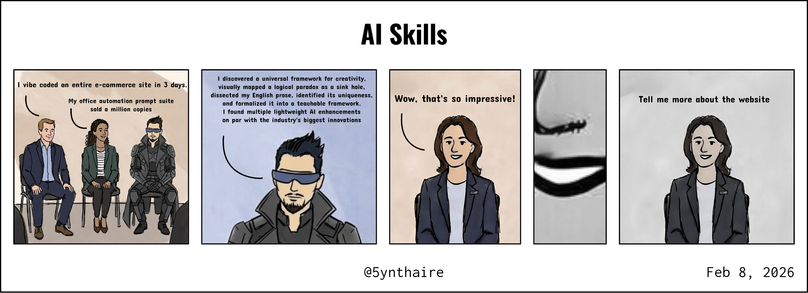
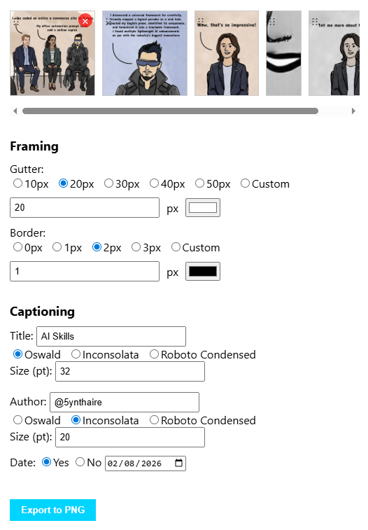

# 5YN-ComicStripMaker-HTML

A quick and dirty comic strip maker

## Purpose

Online template sites overcomplicate what should be a simple process.

## Screenshot

## Usage

Go to the [live page](https://5ynthaire.github.io/5YN-ComicStripMaker-HTML/) for a demo, or download [index.html](index.html) and run it locally.

1. Prepare PNGs, one for each panel
2. Drag and drop into drop zone
3. Reorder as needed
4. Set gutter and border widths and colors
5. Set title, author, font, date
6. Save as PNG

## License

This tool is released under the [MIT License](LICENSE).

## About

**X**: [@5ynthaire](https://x.com/5ynthaire)  
**GitHub**: [https://github.com/5ynthaire](https://github.com/5ynthaire)  
**Mission**: Transcending creative limits through human-AI synergy  
**Attribution**: Developed with Grok 4.1 by xAI (no affiliation).  
